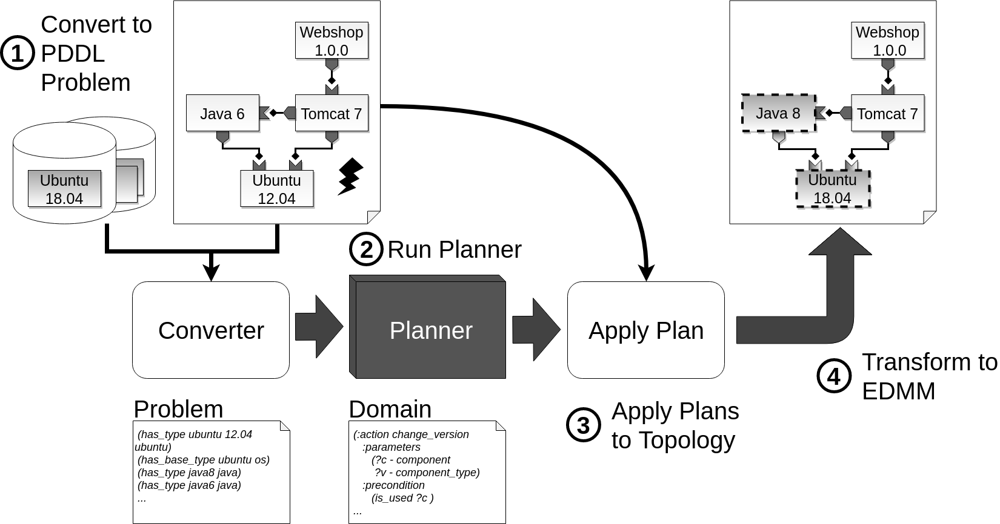

# Constraint-Based Automated Updating of Application Deployment Models

This repository contains the prototype for the bachelor thesis    
"Constraint-Based Automated Updating of Application Deployment Models"   
The motivating scenario in the [thesis](thesis.pdf) is included in the edmm/ folder and will be run by default.  

## Overview



The approach converts an [Essential Deployment Meta Model](https://github.com/UST-EDMM/spec-yaml) to a PDDL problem which is then solved by a planner. The domain ensures that the model is deploy able and the goal state tells the planner which components to update. Many deployment models can be converted to EDMM by using a [converter](https://github.com/UST-EDMM/transformation-framework). However, this prototype can easily be changed to import different deployment models in the future.

## Setup
This project uses a planner to update deployment models. As of right now, 
[Fast Downward](http://www.fast-downward.org/) and [Marvin](https://nms.kcl.ac.uk/planning/software/marvin.html) are supported. The path to the executables has to be specified in the [config.ini](config.ini) file.   
The prototype can not be run without a planner!

## Requirements
can be found in [requirements.txt](requirements.txt)

```
pip3 install -r requirement.txt
```
installes all necessary requirements for python3

```
python3 main.py
```
runs the prototype
